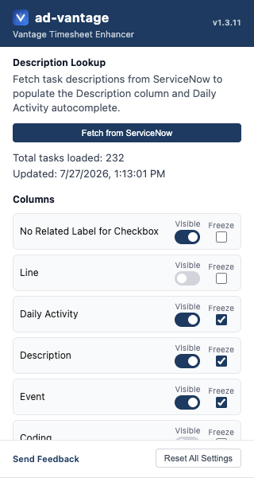
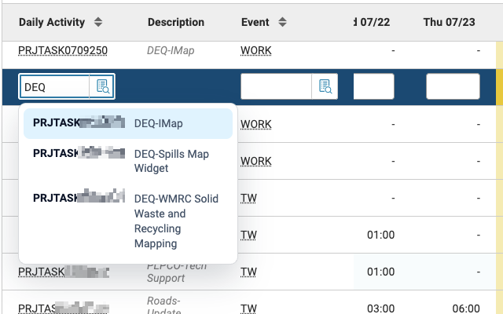
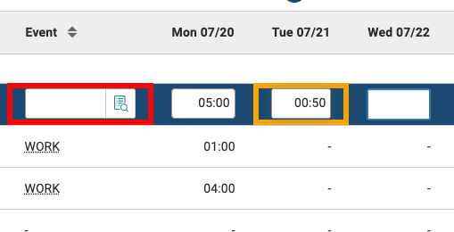

# ad-vantage

A Chrome extension that makes the [Vantage timesheet app](https://vantage.utah.gov/) easier to use — freeze and hide columns, add task descriptions, and get autocomplete while entering daily activities.

## Features

- **Frozen columns** — Keep key columns like employee name and project code pinned while you scroll horizontally through date columns.
- **Hidden columns** — Declutter your view by hiding columns you don't need.
- **Description lookup column** — Add an optional column that displays task descriptions fetched from ServiceNow.
- **Daily Activity autocomplete** — Get suggestions as you type in the Daily Activity field, sourced from your synced task data.
- **Update Timesheet shortcut** — On `Timesheet (TIMEI)` in the `Daily Activity` tab, adds an `Update Timesheet` button next to the lower three-dot menu so you can trigger the native action in one click.
- **Automatic pagination upgrade** — On grids that expose larger page sizes, the extension automatically selects the highest available visible option only when the grid is in a verified fallback state at the default 20 rows, including after adding a new row when the grid resets.
- **Quarter-hour warnings** — Time cells that don't end in `:00`, `:15`, `:30`, or `:45` are highlighted with an orange outline, helping you catch accidental decimal-style entries.
- **Missing Event warnings** — An empty Event cell is highlighted with a red outline when its row contains entered hours.
- Works on both `vantage.utah.gov` and `vantage.access.utah.gov` (for non-state networks).

<p align="center"></p>

Type-ahead search for tasks based on description:

<p align="center"></p>

Warnings for non-quarter-hour time entries or blank values in the Event column:

<p align="center"></p>

## Installation

Install directly from the [Chrome Web Store](https://chromewebstore.google.com/detail/ad-vantage/cojahhgafebkcbophmfofpihokooonod). Note that this extension is currently only available to State of Utah DTS employees.

The extension icon will appear in your Chrome toolbar. It is only active when you are on the Vantage site.

## Usage

1. **Navigate to Vantage** at `https://vantage.utah.gov/` (or `https://vantage.access.utah.gov/`).
2. The extension activates automatically — columns are frozen and your saved visibility preferences are applied.
3. **Click the extension icon** in your Chrome toolbar to open the popup, where you can:
   - Show or hide individual columns.
   - Fetch the current task descriptions from ServiceNow.
4. On `Timesheet (TIMEI)` with the `Daily Activity` grid visible, use the added `Update Timesheet` button beside the lower three-dot menu to run the same native update action without opening the menu first.
5. When a grid shows inline pagination options such as `50` or `100`, the extension automatically switches to the highest enabled option only after it detects a verified fallback to `20`, and it will not repeat that native click just because the page emitted more generic mutation noise.

### ServiceNow Task Sync

Use **Fetch from ServiceNow** in the popup to sign in and load current task descriptions. The extension uses that information to populate the Description column and provide suggestions while entering Daily Activity codes. Your task data stays associated with your current browser profile.

The sync request times out after 30 seconds. When it fails or times out, the popup shows an error and lets you try again.

## DTS Guide

There is also a [DTS User Guide Doc](https://docs.google.com/document/d/1ymagre8ttmPwVQLXsuaJRTw5BJWvLKGSXjzBMVTiM-g/edit?usp=sharing).

---

## Developer Guide

### Prerequisites

- [Node.js](https://nodejs.org/) 24+
- [pnpm](https://pnpm.io/) (install with `npm install -g pnpm` or via [other methods](https://pnpm.io/installation))

### Local Development

1. **Install dependencies:**

   ```bash
   pnpm install
   ```

2. **Start the development server:**

   ```bash
   pnpm dev
   ```

   This starts the Vite dev server with HMR via `@crxjs/vite-plugin`. Extension files are written to `dist-dev` and require `http://localhost:5173` to remain running. Vite loads the development ServiceNow endpoint and public OAuth client ID from `.env.development`.

3. **Launch the dedicated debug browser:**

   ```bash
   pnpm chrome:dev
   ```

   Opens Google Chrome Dev with remote debugging on `http://127.0.0.1:9223`. Keep this browser open while using MCP-based browser inspection.

4. In the Chrome Dev window, go to `chrome://extensions/`, enable **Developer mode**, and load the `dist-dev` folder as an unpacked extension.

5. Log in to Vantage in that same Chrome Dev window.

6. Reload VS Code after the browser is running so the MCP server in `.vscode/mcp.json` can connect.

You can verify the remote debugging endpoint with:

```bash
curl http://127.0.0.1:9223/json/version
```

> If Chrome Dev is already running without the remote debugging flag, macOS may reuse the existing instance and ignore the new launch arguments. Quit Chrome Dev and run `pnpm chrome:dev` again.

### Production Build

```bash
pnpm build
```

Bundles and minifies the extension into the `dist` folder using the ServiceNow endpoint and public OAuth client ID from `.env.production`. Replace its client ID placeholder with the production OAuth application's public client ID before building. Load `dist` as an unpacked extension in `chrome://extensions/` to test the production build.

### ServiceNow Integration

The popup uses OAuth 2.0 Authorization Code with PKCE to fetch tasks from the Utah ServiceNow instance. The extension is a public OAuth client and does not contain or store a client secret.

ServiceNow configuration is selected at build time through Vite modes:

- `pnpm dev` uses `.env.development`.
- `pnpm build` uses `.env.production`.
- Tests use deterministic values from `.env.test`.

These checked-in files contain public endpoints and OAuth client IDs, not client secrets. The generated extension manifest requests access only to the ServiceNow host selected for that build. Each ServiceNow OAuth Application Registry entry must allow the redirect URI returned by `chrome.identity.getRedirectURL()` for the corresponding extension ID.

The task request uses the `sysparm_query` filter defined in [src/background/servicenow.ts](src/background/servicenow.ts).

The ServiceNow OAuth Application Registry entry must be configured as a public/external client with the Authorization Code grant and PKCE enabled. The user must have permission to read `pm_project_task` records.

Fetched lookup data is stored in the current Chrome profile's isolated `chrome.storage.local` area, while OAuth tokens are kept in `chrome.storage.session` (cleared when the browser restarts). Neither is synced to other devices. Tokens are refreshed automatically and cleared internally if ServiceNow rejects a refresh token.

Test local queries using the [REST API Explorer](https://dev.workspaces.dts.utah.gov/now/nav/ui/classic/params/target/%24restapi.do) in the dev instance.

Dev ServiceNow Instance: <https://utahdev.servicenowservices.com/>

### Tests

```bash
pnpm test
```

### Chrome Web Store

The release workflow can publish new versions to the Chrome Web Store after the first manual submission.

#### First-Time Store Setup

1. Create a Chrome Web Store developer account and enable 2-step verification.
2. Run `pnpm build`.
3. Upload the `dist` contents as a new item in the Chrome Web Store dashboard.
4. Complete the listing, privacy, and distribution sections, then submit so Google assigns a permanent extension ID.

#### Automated Publishing via GitHub Actions

The release workflow uses GitHub Actions OIDC with Google Workload Identity Federation (WIF) to impersonate a Google Cloud service account. It does not use long-lived OAuth refresh tokens or service account key files.

Add these repository secrets to enable automated publishing on release:

- `EXTENSION_ID`
- `PUBLISHER_ID` - Chrome Web Store publisher ID from the Developer Dashboard's Publisher settings.
- `GCP_WORKLOAD_IDENTITY_PROVIDER` - full WIF provider resource name, in the form `projects/PROJECT_NUMBER/locations/global/workloadIdentityPools/POOL_ID/providers/PROVIDER_ID`.
- `GCP_SERVICE_ACCOUNT_EMAIL` - email address of the service account added to the Chrome Web Store publisher.

Before publishing, enable the Chrome Web Store API in the Google Cloud project and add the service account in the Chrome Web Store Developer Dashboard under Account. A publisher can have one service account.

The existing WIF provider and IAM binding must allow this repository's release workflow to impersonate the service account. Restrict that trust condition to tags matching `refs/tags/v*`.

If any required secret or variable is missing, the release workflow still uploads the built zip to GitHub Releases and skips the Chrome Web Store step.

Once configured, each published GitHub release builds the extension, uploads the archive to GitHub Releases, uses WIF to obtain a short-lived service-account access token, then uploads and submits the extension to the Chrome Web Store.

### Releases

Releases are managed with `agrc/release-composite-action` via GitHub Actions using conventional commits.

| Commit type | Release bump |
| ----------- | ------------ |
| `feat`      | minor        |
| `fix`       | patch        |
| `docs`      | patch        |
| `style`     | patch        |
| `deps`      | patch        |

- Pushes to `dev` create or update prerelease PRs and tags.
- Pushes to `main` create or update stable release PRs and tags.
- Merging a release PR publishes the release and uploads the built extension archive.

Use squash merges so the PR title becomes the changelog entry. The workflow automatically bumps the version in `package.json` and `manifest.json` — do not edit those files manually to cut a release.
